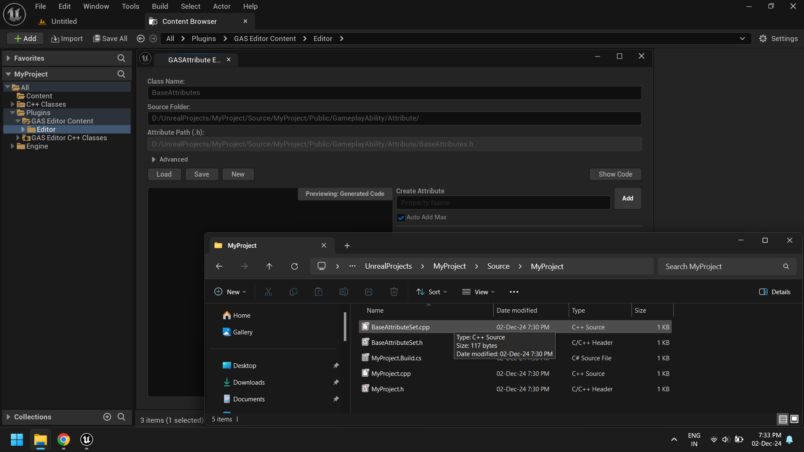
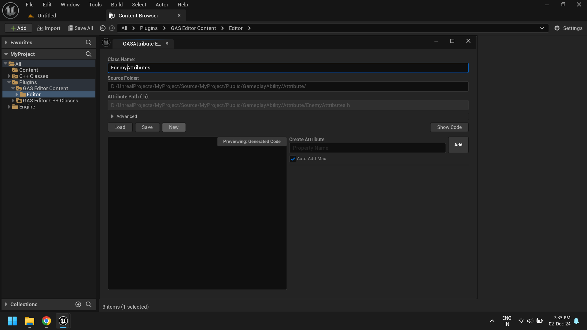

# GAS Editor 🪂
GAS Editor allows to quicky create attribute set and attributes directly from Unreal Engine editor.
Check out video on how to use it:

# Index
- [How to Use ?](#how-to-use)
  - [Enable Gameplay Ability System Plugin](#1-enable-gameplay-ability-system-plugin)
  - [Enable C++ Support](#2-enable-c-support)
  - [Download the Plugin Code](#3-download-the-plugin-code)
  - [Add the Plugin to Your Project](#4-add-the-plugin-to-your-project)
  - [Start the Editor](#5-start-the-editor)
  - [GAS Editor](#6-gas-editor)
  - [Hot Reload](#7-hot-reload)
  - [Testing Attributes](#8-testing-attributes)
- [Editor Window](#editor-window)
- [Known Issues](#known-issues)

# How to use ?

#### 1. Enable Gameplay Ability System Plugin
In the `Plugins` window, enable the `Gameplay Ability System` plugin and restart the editor.

---

#### 2. Enable C++ Support
For the plugin to work, you need to create a base attribute class. This step is necessary to include the required attribute set header files. This is a one-time process.

- Go to `Tools` and click on `New C++ Class`.

- Search for `Attribute Set` and click `Next`.

- Enter the class name. You can choose any name.

- Once created, Unreal Engine will prompt you to open the code editor to build the class. You can choose to build it now to avoid rebuilding later while setting up the plugin, or click No and close Unreal Engine for now.
- For now I'll click `No` and close Unreal Engine.

---

#### 3. Download the Plugin Code
Download the plugin code that matches your Unreal Engine version.

- Go to the `Releases` section.

- Download the `.rar` file.

---

#### 4. Add the Plugin to Your Project

- Create a `Plugins` folder in your project directory if it doesn’t already exist.

- Extract the plugin files and copy the `GASPlugin` folder into the `Plugins` directory.

---

#### 5. Start the Editor

- Launch the project. You’ll be prompted to build the `project` and the `GASPlugin`. If you’ve built the project before, only the plugin will need to be built.

- Once the build completes, the editor will start.

---

#### 6. GAS Editor

- Open the `Plugins` window and ensure that the `GASPlugin` is enabled.

- Navigate to the `GAS plugin` folder. If the folder is not visible, ensure that `Show Plugin Content` is enabled.

- Locate the `GASAttributeEditor` in `Plugins\GAS Editor Content\Editor`. Right-click it and select `Run Editor Utility Widget`.

- Once the editor window is open, you can enter the class name and path of an existing attribute set. For this guide, however, we'll create a new attribute set.

- Enter the class name and path for the new attribute set, then click the `New` button. This will create and load the new attribute set.

- If successfully created, the attribute set will appear in the Generated Code box.

- Add an attribute, like Health, by typing its name and clicking `Add`.

- Save the attribute set by clicking the `Save` button. A success message will appear upon successful saving.

---

#### 7. Hot Reload
After saving the attributes, you can use Live Coding to hot reload the project.

- Click the hot reload button or press `Ctrl + Alt + F11`.

- Once reloaded, the new attributes will be ready for use.

---

#### 8. Testing Attributes
You can create a simple `Gameplay Effect` to test whether the attributes were created successfully.

- Create a new `Gameplay Effect` and open it.

- Navigate to the `Modifiers` section and check if the attributes are listed.

# Editor Window
1. **`Class Name:`**
Specifies the name of the class header file.

2. **`Source Folder:`**
The folder path where the class header file is located.

3. **`Advanced:`**
This section is collapsed by default and provides additional configuration options.

4. **`Template:`**
The template used to generate new attributes. It supports the following placeholders:
    - `_CLASS_` - Represents the name of the base class.
    - `_NAME_` - Represents the name of the attribute.

5. **`Selector:`**
A regex pattern used to match attributes in the code.

6. **`Region:`**
Specifies the region in the code where the generated code will be inserted.

7. **`Test direct public region:`**
If checked, the class's `public:` section and closing `};` will be used as the insertion region instead of the default `GAS_EDITOR_` markers.

8. **`Load:`**
Loads the class header code for editing.

9. **`Save:`**
Saves the generated code to the file.

10. **`New:`**
Creates a new attribute set using the provided class name and source folder. This will override existing file.

11. **`Preview:`**
Toggles between viewing the generated code and the original code.

12. **`Create Attribute:`**
Create options to create or remove attributes.

13. **`Add:`**
Adds a new attribute.

14. **`Auto Add Max:`**
If enabled, automatically creates corresponding `Max` attributes (e.g., `HealthMax` for `Health`).

# Known Issues:
- **Attribute disappearance after editor restart:** If you restart the editor, attributes might disappear. To avoid this, delete the `/Binaries` folder before reopening the editor.

---

## ☄️